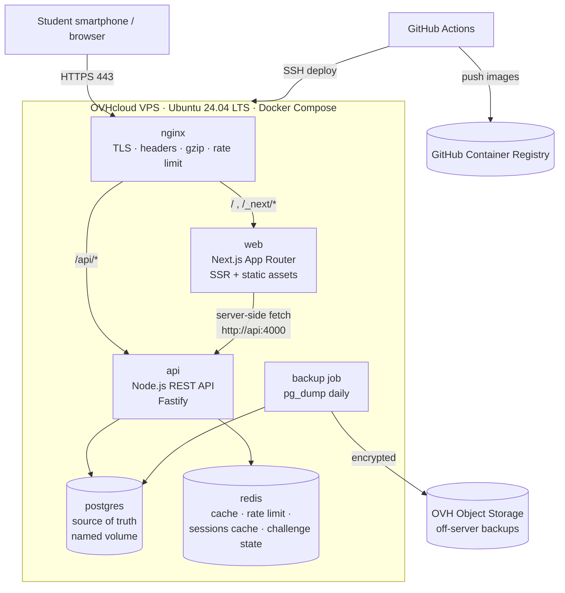
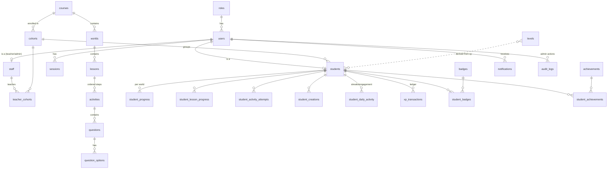

# IT Starter 2028 — Architecture (Phase 0)

> Status: **DRAFT — awaiting approval.** No application code exists yet.
> Guiding rule: _Simple for students. Fun. Mobile-first. Secure. Maintainable._

---

## 1. Final architecture



Key points:

- **One public origin.** Nginx serves `https://<DOMAIN>/` → Next.js and `https://<DOMAIN>/api/` → API. The browser only ever talks to one origin, so auth cookies are first-party, CORS can be locked down, and there is no CORS preflight overhead on mobile.
- **Next.js does not hold business logic or talk to the database.** It renders UI. All rules (scoring, XP, badges, progress, permissions) live in the API.
- **PostgreSQL is the only permanent store.** Redis can be wiped at any time without data loss.
- Only Nginx exposes ports (80/443). Postgres and Redis are on an internal Docker network with no published ports in production.

---

## 2. Technology decisions

| Area             | Decision                                                                                                  | Why                                                                                        |
| ---------------- | --------------------------------------------------------------------------------------------------------- | ------------------------------------------------------------------------------------------ |
| Language         | **TypeScript (strict)** everywhere                                                                        | One language for the team; shared types                                                    |
| Repo layout      | **npm workspaces monorepo** (`apps/web`, `apps/api`, `packages/shared`)                                   | No extra tool (Turbo/Nx) needed; shared validation schemas                                 |
| Frontend         | **Next.js (current stable, App Router) + React**                                                          | Required; SSR gives a fast first paint on slow phones                                      |
| Styling          | **Tailwind CSS** + small in-house component library                                                       | No heavy UI kit; tiny CSS output                                                           |
| Icons / art      | Emoji + **lucide-react** (tree-shaken) + inline SVG illustrations                                         | Near-zero bandwidth, works offline                                                         |
| i18n             | **next-intl** (UI strings) + **JSONB `{en, km}`** fields for DB content                                   | Khmer + English from day 1                                                                 |
| Khmer font       | **Noto Sans Khmer** (self-hosted via `next/font`, subset) + system Latin font                             | Correct Khmer rendering on all Android phones                                              |
| Backend          | **Node.js 22 LTS + Fastify**                                                                              | Fast, built-in structured logging (pino), plugin system for helmet/CORS/rate-limit/cookies |
| Validation       | **Zod** schemas in `packages/shared`, used by API _and_ forms                                             | One definition of every request/response                                                   |
| DB access        | **Drizzle ORM + drizzle-kit migrations** (SQL files committed)                                            | Typed, lightweight, parameterised queries (no SQL injection), readable SQL migrations      |
| Database         | **PostgreSQL 17**                                                                                         | Required                                                                                   |
| Cache            | **Redis 7** (`ioredis`)                                                                                   | Required; caching, rate limit, session cache, challenge state                              |
| Password hashing | **Argon2id** (`@node-rs/argon2`, prebuilt binaries)                                                       | Current best practice; no native build tooling in Docker                                   |
| Sessions         | **Opaque session token in an httpOnly cookie**, stored hashed in Postgres, cached in Redis                | Revocable instantly (logout, teacher resets), no JWT/refresh complexity                    |
| Drag & drop      | **Pointer Events** (custom hook) + tap-to-select fallback                                                 | HTML5 DnD does not work on mobile touch                                                    |
| PWA              | Web manifest + **hand-written service worker**                                                            | Static caching only; avoids a plugin dependency                                            |
| Unit / API tests | **Vitest** + Fastify `inject()` against real Postgres/Redis (Docker)                                      | Fast, no mocks for the DB layer                                                            |
| Frontend tests   | **Vitest + React Testing Library**                                                                        | Component behaviour                                                                        |
| E2E              | **Playwright** (mobile viewports: Pixel 7, iPhone 14)                                                     | Real mobile emulation                                                                      |
| Lint / format    | ESLint + Prettier, `tsc --noEmit` in CI                                                                   | Required                                                                                   |
| CI/CD            | **GitHub Actions** → build images → **GHCR** → SSH deploy to VPS                                          | Images built in CI, not on the small VPS                                                   |
| TLS              | **Let's Encrypt via Certbot** (webroot), auto-renew                                                       | Required                                                                                   |
| Backups          | `pg_dump` daily → gzip → encrypt (`age`) → **OVH Object Storage** via `rclone`                            | Off-server, retention policy, documented restore                                           |
| Logging          | pino JSON logs → Docker `json-file` with rotation                                                         | Structured, redacted; no extra infra                                                       |
| Monitoring       | `/health` endpoints + Docker healthchecks + external uptime monitor (e.g. Uptime Kuma or OVH/UptimeRobot) | Minimal and sufficient for MVP                                                             |

### Decisions that were missing from the brief (my proposal)

1. **How students log in.** Students may not have email. → **Username + password issued by staff** (bulk CSV import generates usernames + temporary passwords; student sets own password on first login). Teachers can reset a student's password. No email-based reset in MVP.
2. **Classes/cohorts.** "Teachers see appropriate students" needs a grouping. → Add `cohorts` and `teacher_cohorts`; teachers only see students in their cohorts.
3. **What "progress %" means.** → World % = completed lessons ÷ published lessons in world. Course % = completed ÷ all published lessons.
4. **Lesson structure ↔ data model.** The 6 steps (Welcome → Learn → See → Play → Challenge → Reward) are **ordered activities inside a lesson**, each with a `step` tag. "Learn"/"See" are unscored content activities; "Play"/"Challenge" are scored. Reward is generated by the engine.
5. **What earns XP.** XP is awarded **once per activity (first correct completion) and once per lesson (first completion)**, enforced by a unique DB constraint. Retries are free and encouraged but don't farm XP.
6. **Where answers are checked.** **Always server-side.** The client never receives `is_correct` flags. Random math questions are generated server-side; the expected answer lives in Redis (`challenge:{id}`, 15-min TTL).
7. **Streak timezone.** Calendar days in **Asia/Phnom_Penh** (configurable).
8. **Leaderboard.** Competition conflicts with "low-pressure". → **Off by default**; optional per-cohort toggle later. Personal progress is the focus.
9. **Creative work** (My Profile, Budget, My Dream, prompts) is saved to `student_creations` so students can see "My Work". Completed on submit; never graded right/wrong.
10. **Images/uploads.** MVP has **no user file uploads** except CSV import (in-memory, size-limited). Content uses emoji, SVG and images shipped with the app. An admin media library can come later.
11. **AI Playground** works **without any external AI API** — prompt builder, prompt comparison and "spot the AI mistake" activities use pre-written example responses.

---

## 3. Database ERD

Conventions: UUID v7 primary keys (time-ordered, index-friendly) except small lookup tables; `created_at`/`updated_at` (`timestamptz`) on every mutable table; **soft delete** (`deleted_at`) on users and content tables; content has `status` = `draft | published | archived`. Localised text columns are `jsonb` shaped `{"en": "...", "km": "..."}`.



### Tables

**Identity & access**

| Table             | Key columns                                                                                                                                                                                           | Constraints / indexes                                                     |
| ----------------- | ----------------------------------------------------------------------------------------------------------------------------------------------------------------------------------------------------- | ------------------------------------------------------------------------- |
| `roles`           | `id smallint`, `code` (`STUDENT`,`TEACHER`,`ADMIN`)                                                                                                                                                   | unique `code`                                                             |
| `users`           | `id`, `username citext`, `email citext null`, `password_hash`, `role_id`, `display_name`, `locale`, `status` (`active`/`disabled`), `must_change_password`, `last_login_at`, timestamps, `deleted_at` | unique `username` (where not deleted), unique `email` (partial, not null) |
| `students`        | `user_id` PK/FK, `cohort_id`, `xp_total` (cached), `level`, `current_streak`, `longest_streak`, `last_active_date`                                                                                    | idx `cohort_id`, idx `xp_total`                                           |
| `staff`           | `user_id` PK/FK, `title`                                                                                                                                                                              | covers the brief's "admins" table for both TEACHER and ADMIN              |
| `cohorts`         | `id`, `course_id`, `name`, `year`                                                                                                                                                                     |                                                                           |
| `teacher_cohorts` | `staff_user_id`, `cohort_id`                                                                                                                                                                          | PK both                                                                   |
| `sessions`        | `id`, `user_id`, `token_hash` (SHA-256), `expires_at`, `last_seen_at`, `user_agent`, `revoked_at`                                                                                                     | unique `token_hash`, idx `user_id`                                        |

**Content (admin-managed, data-driven)**

| Table              | Key columns                                                                                                                                                                                               | Constraints / indexes                                     |
| ------------------ | --------------------------------------------------------------------------------------------------------------------------------------------------------------------------------------------------------- | --------------------------------------------------------- |
| `courses`          | `id`, `slug`, `title jsonb`, `description jsonb`, `status`, `deleted_at`                                                                                                                                  | unique `slug`                                             |
| `worlds`           | `id`, `course_id`, `slug`, `title`, `description`, `icon`, `color`, `position`, `status`, `badge_id null`                                                                                                 | unique (`course_id`,`slug`), idx (`course_id`,`position`) |
| `lessons`          | `id`, `world_id`, `slug`, `title`, `summary`, `estimated_minutes`, `position`, `xp_reward`, `status`                                                                                                      | unique (`world_id`,`slug`), idx (`world_id`,`position`)   |
| `activities`       | `id`, `lesson_id`, `step` (`welcome/learn/see/play/challenge/reward`), `type` (see §5), `title`, `config jsonb` (validated per type by Zod), `is_scored`, `pass_score`, `xp_reward`, `position`, `status` | idx (`lesson_id`,`position`)                              |
| `questions`        | `id`, `activity_id`, `kind`, `prompt jsonb`, `media`, `hint jsonb`, `explanation jsonb`, `difficulty` 1–3, `config jsonb`, `position`                                                                     | idx (`activity_id`,`position`)                            |
| `question_options` | `id`, `question_id`, `label jsonb`, `media`, `group_key` (public: matching side / drag bucket), `is_correct`, `match_key`, `correct_order`, `position`                                                    | idx `question_id`                                         |
| `badges`           | `id`, `code`, `name jsonb`, `description jsonb`, `icon`, `criteria jsonb`, `status`                                                                                                                       | unique `code`                                             |
| `achievements`     | `id`, `code`, `name`, `description`, `icon`, `criteria jsonb`, `xp_bonus`                                                                                                                                 | unique `code`                                             |
| `levels`           | `number` PK, `name jsonb`, `icon`, `min_xp`                                                                                                                                                               | unique `min_xp`                                           |

**Progress & gamification**

| Table                       | Key columns                                                                                                                           | Constraints / indexes                                                                          |
| --------------------------- | ------------------------------------------------------------------------------------------------------------------------------------- | ---------------------------------------------------------------------------------------------- |
| `student_progress`          | `student_id`, `world_id`, `lessons_completed`, `lessons_total`, `percent`, `last_activity_at`                                         | PK (`student_id`,`world_id`) — denormalised, recomputed on lesson completion                   |
| `student_lesson_progress`   | `student_id`, `lesson_id`, `status`, `current_position`, `best_score`, `attempts`, `time_spent_seconds`, `started_at`, `completed_at` | PK (`student_id`,`lesson_id`), idx (`lesson_id`,`status`) for analytics                        |
| `student_activity_attempts` | `id`, `student_id`, `activity_id`, `question_id null`, `answer jsonb`, `is_correct`, `score`, `duration_ms`, `created_at`             | idx (`student_id`,`activity_id`), idx (`activity_id`, `is_correct`) for "difficult activities" |
| `student_creations`         | `student_id`, `activity_id`, `content jsonb`, timestamps                                                                              | PK (`student_id`,`activity_id`)                                                                |
| `student_daily_activity`    | `student_id`, `day date`, `xp_earned`, `seconds_active`, `lessons_completed`                                                          | PK (`student_id`,`day`) — streaks + "active students"                                          |
| `xp_transactions`           | `id`, `student_id`, `amount`, `source_type` (`activity/lesson/achievement/admin`), `source_id`, `created_at`                          | **unique (`student_id`,`source_type`,`source_id`)** → XP can't be duplicated                   |
| `student_badges`            | `student_id`, `badge_id`, `awarded_at`                                                                                                | PK both                                                                                        |
| `student_achievements`      | `student_id`, `achievement_id`, `awarded_at`                                                                                          | PK both                                                                                        |

**System**

| Table           | Key columns                                                                                 |
| --------------- | ------------------------------------------------------------------------------------------- |
| `notifications` | `id`, `user_id`, `type`, `payload jsonb`, `read_at`, `created_at` (idx `user_id, read_at`)  |
| `audit_logs`    | `id`, `actor_user_id`, `action`, `entity_type`, `entity_id`, `metadata jsonb`, `created_at` |

---

## 4. API architecture

**Base:** `https://<DOMAIN>/api` · JSON only · cookie auth · all inputs validated with Zod.

**Response envelope**

```json
{ "success": true, "data": { }, "meta": { "page": 1, "pageSize": 20, "total": 134 } }
{ "success": false, "error": { "code": "LESSON_NOT_FOUND", "message": "Lesson not found", "details": [] } }
```

Error codes are stable strings (`VALIDATION_ERROR`, `UNAUTHENTICATED`, `FORBIDDEN`, `NOT_FOUND`, `RATE_LIMITED`, `CONFLICT`, `INTERNAL_ERROR`, …). Stack traces never leave the server. Lists use `?page=&pageSize=` (max 100).

**Layering inside the API** (business logic kept out of routes):

```
route (HTTP + Zod schema) → service (business rules) → repository (Drizzle queries)
                                   ↘ cache (Redis)      ↘ engine (scoring, xp, badges, progress)
```

**Endpoints**

| Group           | Endpoints                                                                                                                                                                                                                                                | Role                          |
| --------------- | -------------------------------------------------------------------------------------------------------------------------------------------------------------------------------------------------------------------------------------------------------- | ----------------------------- |
| Health          | `GET /api/health` (liveness), `GET /api/health/ready` (checks PG + Redis)                                                                                                                                                                                | public                        |
| Auth            | `POST /auth/login`, `POST /auth/logout`, `GET /auth/me`, `POST /auth/change-password`                                                                                                                                                                    | public / any                  |
| Me              | `PATCH /me` (display name, locale)                                                                                                                                                                                                                       | any                           |
| Content         | `GET /courses`, `GET /courses/:id`, `GET /worlds/:id`, `GET /lessons/:id`                                                                                                                                                                                | any logged-in                 |
| Learning        | `POST /lessons/:id/start`, `POST /lessons/:id/complete`, `GET /activities/:id` (answers stripped), `POST /activities/:id/answer`, `POST /activities/:id/challenge` (new random question), `PUT /activities/:id/creation`                                 | STUDENT                       |
| Progress        | `GET /progress`, `GET /progress/worlds/:id`, `GET /badges`, `GET /achievements`, `GET /notifications`, `POST /notifications/:id/read`                                                                                                                    | STUDENT (own data only)       |
| Teacher         | `GET /teacher/cohorts`, `GET /teacher/cohorts/:id/students`, `GET /teacher/students/:id`, `POST /teacher/students/:id/reset-password`                                                                                                                    | TEACHER (own cohorts) / ADMIN |
| Admin – people  | `GET/POST /admin/students`, `GET/PATCH/DELETE /admin/students/:id`, `POST /admin/students/import` (CSV), `…/admin/staff`, `…/admin/cohorts`                                                                                                              | ADMIN                         |
| Admin – content | CRUD `/admin/courses`, `/admin/worlds`, `/admin/lessons`, `/admin/activities`, `/admin/questions`, `/admin/badges`, `/admin/achievements`; `POST /admin/{worlds,lessons,activities}/reorder`; `POST /admin/{courses,lessons}/:id/publish` · `/unpublish` | ADMIN                         |
| Analytics       | `GET /admin/analytics/overview`, `/engagement`, `/worlds` (with per-lesson stats), `/activities` · `?cohortId=&days=7                                                                                                                                    | 30                            | 90` | ADMIN (TEACHER: cohort-scoped) |

**Answer flow** (`POST /activities/:id/answer`) in one DB transaction:
validate → check answer server-side → write attempt → if first correct completion: insert `xp_transactions` (`ON CONFLICT DO NOTHING`) → update `students.xp_total`/level, daily activity, streak → evaluate badges/achievements → commit → invalidate `student:{id}:progress` → return `{ correct, feedbackKey, explanation, hint, xpAwarded, newBadges, levelUp }`.

### Redis usage

| Key                                                      | Purpose                                     | TTL / invalidation                        |
| -------------------------------------------------------- | ------------------------------------------- | ----------------------------------------- |
| `content:v`                                              | global content version counter              | bumped on any admin content write         |
| `content:{v}:course:{id}` / `world:{id}` / `lesson:{id}` | cached published content (answers stripped) | auto-invalidated by version bump; 1 h TTL |
| `session:{tokenHash}`                                    | session → user/role lookup                  | 10 min; deleted on logout/reset           |
| `student:{id}:progress`                                  | dashboard payload                           | 5 min; deleted on any progress write      |
| `challenge:{id}`                                         | generated question + expected answer        | 15 min                                    |
| `rl:{route}:{ip}` / `rl:login:{username}`                | rate limiting                               | sliding window                            |
| `analytics:{name}:{scope}`                               | expensive aggregates                        | 5 min                                     |
| `leaderboard:{cohortId}` (optional, off)                 | sorted set                                  | rebuilt from PG                           |

If Redis is down, the API degrades gracefully (reads go to Postgres; rate limiting fails closed only for `/auth/login`).

---

## 5. Frontend architecture

**Routes (App Router)**

```
app/[locale]/
  (public)/login
  (student)/                 ← requires STUDENT
    page.tsx                 Dashboard: welcome, %, XP, streak, continue, worlds, badges
    worlds/[worldSlug]       World map: lesson list with progress
    lessons/[lessonId]       Lesson player (single client component, step-by-step)
    badges, profile, my-work
  (staff)/admin/...          ← requires TEACHER/ADMIN; lazy-loaded, never in student bundle
    students, cohorts, content/{courses,worlds,lessons,activities,questions}, badges, analytics
```

- **Server Components** fetch data from the API over the internal network (forwarding the session cookie) → fast first paint, little JS.
- **Client Components** only where interaction is needed (lesson player, activities, forms). They call `/api/*` on the same origin.
- **Middleware** handles locale (`/en`, `/km`, remembered in a cookie) and redirects unauthenticated users to login. Real authorization is always enforced by the API.
- **Data-driven learning engine:** the lesson player loads activities and renders each through an **activity registry** `type → component`. No lesson-specific React components. Adding a lesson = adding rows in the DB.

**Activity types (registry)**

| Category      | Types                                                                                                                                               |
| ------------- | --------------------------------------------------------------------------------------------------------------------------------------------------- |
| Content       | `intro`, `learn_card`, `see_example`, `reward`                                                                                                      |
| Quiz          | `multiple_choice`, `true_false`, `image_choice`, `safe_or_dangerous`                                                                                |
| Interactive   | `drag_drop`, `matching`, `ordering`, `tap_objects`, `number_input`, `pattern`, `math_generator`                                                     |
| Simulations   | `mouse_trainer`, `keyboard_challenge`, `shortcut_quiz`, `file_explorer_sim`, `word_sim`, `spreadsheet_sim`, `slides_sim`, `search_sim`, `email_sim` |
| Creative / AI | `free_text`, `profile_builder`, `prompt_builder`, `prompt_compare`, `ai_fact_check`                                                                 |

Each type has a Zod `config` schema in `packages/shared`, used by the admin editor (form) and the API (validation) — one source of truth.

**Design system** (Phase 4): tokens (colour per world, spacing, radius, type scale with min 16 px body / larger Khmer line-height), `Button` (min 48 px touch target), `Card`, `ProgressBar`, `XpPill`, `StreakFlame`, `BadgeIcon`, `WorldCard`, `FeedbackToast` (encouraging copy only), `BottomNav` (mobile) / side nav (≥1024 px), form controls. CSS-only animations, disabled under `prefers-reduced-motion`.

---

## 6. Docker architecture

| Service    | Image                                                                      | Dev                              | Prod                                         |
| ---------- | -------------------------------------------------------------------------- | -------------------------------- | -------------------------------------------- |
| `web`      | `apps/web/Dockerfile` (multi-stage, Next.js `standalone` output, non-root) | hot reload via bind mount        | image from GHCR                              |
| `api`      | `apps/api/Dockerfile` (multi-stage, prod deps only, non-root)              | hot reload (`tsx watch`)         | image from GHCR                              |
| `postgres` | `postgres:17-alpine`                                                       | port 5432 published to localhost | **no published port**, named volume `pgdata` |
| `redis`    | `redis:7-alpine` (AOF off, `maxmemory` + LRU)                              | port 6379 to localhost           | no published port, password set              |
| `nginx`    | `nginx:alpine` + `infra/nginx/*.conf`                                      | optional (http only)             | 80/443, certs volume                         |
| `migrate`  | api image, one-off `npm run db:migrate`                                    | `docker compose run`             | run by deploy script before `up`             |
| `backup`   | small image with `pg_dump`, `age`, `rclone`, cron                          | —                                | daily                                        |

All services have **healthchecks**; `api` waits for healthy `postgres` + `redis`; `web` waits for `api`. Files: `docker-compose.yml` (dev), `docker-compose.prod.yml` (prod), `.env.example`.

---

## 7. Security architecture

| Concern       | Control                                                                                                                                                                                                                     |
| ------------- | --------------------------------------------------------------------------------------------------------------------------------------------------------------------------------------------------------------------------- |
| Transport     | HTTPS only (Let's Encrypt), HTTP→HTTPS redirect, HSTS                                                                                                                                                                       |
| Passwords     | Argon2id; min length 8; staff-issued temp passwords force change on first login                                                                                                                                             |
| Sessions      | 256-bit random token; only SHA-256 hash stored; cookie `HttpOnly; Secure; SameSite=Lax; Path=/`; 14-day sliding expiry (students), 12 h (staff); revoke on logout/password reset; "log out" prominent for **shared phones** |
| CSRF          | SameSite=Lax + `Origin` check on all non-GET requests + required `X-Requested-With` header                                                                                                                                  |
| Authorization | RBAC hook per route (`requireRole`) + **ownership/scope checks in services** (student → own data; teacher → own cohorts)                                                                                                    |
| Input         | Zod on every body/query/param; body size limits; CSV import size/row limits                                                                                                                                                 |
| SQL injection | Parameterised queries only (Drizzle); no string-built SQL                                                                                                                                                                   |
| XSS           | React escaping; **no `dangerouslySetInnerHTML`** for content (rich text stored as structured blocks); strict CSP                                                                                                            |
| Headers       | `@fastify/helmet` + Nginx: CSP, HSTS, X-Content-Type-Options, Referrer-Policy, Permissions-Policy, frame-ancestors none                                                                                                     |
| Rate limiting | Nginx `limit_req` (coarse) + Redis rate limit in API (login: 5 wrong passwords per username per 15 min, 60 wrong passwords per IP per 10 min)                                                                               |
| CORS          | Same origin; API allowlist = `APP_ORIGIN` only                                                                                                                                                                              |
| Secrets       | `.env` never committed (`.gitignore`), GitHub Actions secrets for deploy, `.env.example` with placeholders                                                                                                                  |
| Logging       | pino with redaction of `password`, `token`, `cookie`, `authorization`; audit log table for admin actions                                                                                                                    |
| Server        | UFW (22/80/443 only), SSH keys only, root login off, fail2ban, unattended-upgrades, non-root containers                                                                                                                     |
| Privacy       | Collect minimum student data (username, display name, cohort). No phone numbers/addresses. Analytics are aggregate.                                                                                                         |

---

## 8. Folder structure

```
it-starter-2028/                 (this folder: goloni/)
├─ apps/
│  ├─ web/                       Next.js
│  │  ├─ src/app/[locale]/...    routes (see §5)
│  │  ├─ src/components/ui/      design system
│  │  ├─ src/components/learning/  lesson player + activity registry + activities/*
│  │  ├─ src/components/admin/
│  │  ├─ src/lib/                api client, auth helpers, formatting
│  │  ├─ src/i18n/               next-intl config
│  │  ├─ messages/{en,km}.json   UI strings
│  │  ├─ public/                 manifest, icons, sw.js, illustrations
│  │  └─ Dockerfile
│  └─ api/                       Node.js REST API
│     ├─ src/app.ts, server.ts
│     ├─ src/config/             env parsing (Zod)
│     ├─ src/plugins/            db, redis, auth, rate-limit, errors, security
│     ├─ src/modules/<name>/     routes.ts · service.ts · repository.ts  (auth, content, learning, progress, gamification, admin, analytics, teacher)
│     ├─ src/engine/             scoring, generators (math), xp, levels, badges, streaks — pure functions
│     ├─ src/db/schema/          Drizzle schema
│     ├─ src/db/migrations/      SQL migrations
│     ├─ src/db/seed/            seed runner + content/*.ts (90 lessons)
│     ├─ test/                   unit + API tests
│     └─ Dockerfile
├─ packages/
│  └─ shared/                    Zod schemas, DTO types, activity config schemas, error codes
├─ e2e/                          Playwright tests
├─ infra/
│  ├─ nginx/                     nginx.conf, site template (domain from env)
│  ├─ backup/                    Dockerfile, backup.sh, restore.sh
│  └─ server/                    VPS bootstrap script (UFW, SSH, Docker, fail2ban)
├─ .github/workflows/            ci.yml (lint/type/test/e2e), deploy.yml
├─ docs/                         ARCHITECTURE.md, SECURITY.md, DEPLOYMENT.md, BACKUP.md, CONTENT_GUIDE.md
├─ docker-compose.yml            dev
├─ docker-compose.prod.yml       prod
├─ .env.example
├─ package.json                  workspaces + root scripts
└─ README.md
```

---

## 9. Development phases

Same order as the brief; each phase ends with: summary → files changed → tests run (real output) → how to run → **wait for approval**.

| #   | Phase                       | Main outcome                                                                   | Exit criteria (tested)                                          |
| --- | --------------------------- | ------------------------------------------------------------------------------ | --------------------------------------------------------------- |
| 0   | Requirements + architecture | this document                                                                  | approved                                                        |
| 1   | Foundation                  | monorepo, Next.js, API, Docker dev stack, env, health checks, README           | `web → api → postgres` and `api → redis` health green in Docker |
| 2   | Database                    | full schema, migrations, minimal seed                                          | migrate/seed/CRUD tests pass                                    |
| 3   | Authentication              | login/logout/me, sessions, RBAC, rate limit                                    | auth + authorization tests per role                             |
| 4   | Design system + i18n        | tokens, components, EN/KM switch, Khmer font                                   | component tests; visual check 320→1440 px                       |
| 5   | Student dashboard           | dashboard, worlds, profile, badges page                                        | renders at 320/375/390/430/768/1024/1440                        |
| 6   | Learning engine             | lesson player, activity registry, answer API, XP/progress plumbing             | lesson → answer → XP → progress test                            |
| 7   | Brain Playground            | math generators, hints, 10 lessons (later split into Math + Logic, 30 lessons) | generator unit tests, lessons playable                          |
| 8   | Computer Explorer           | mouse/keyboard/file sims, 10 lessons                                           | touch-tested activities                                         |
| 9   | Office Creator              | Word/Excel/PowerPoint sims, 8 lessons                                          | SUM/AVERAGE logic tests                                         |
| 10  | Internet Explorer           | search/email sims, Safe-or-Dangerous, 8 lessons                                |                                                                 |
| 11  | AI Playground               | prompt levels, prompt builder, AI fact-check, 8 lessons                        |                                                                 |
| 12  | Gamification                | levels, badges, achievements, streaks, rewards                                 | XP-duplication tests                                            |
| 13  | Admin dashboard             | students/import, content CRUD, reorder, publish                                | admin API + UI tests                                            |
| 14  | Analytics                   | overview, world/lesson/activity difficulty, engagement                         | query tests on seeded data                                      |
| 15  | PWA                         | manifest, icons, SW, install prompt                                            | Lighthouse PWA/perf check; Android + iOS manual                 |
| 16  | Security review             | review + fixes                                                                 | checklist in `docs/SECURITY.md`                                 |
| 17  | Testing                     | full unit/API/frontend/E2E suite                                               | CI green                                                        |
| 18  | Production                  | prod compose, Nginx/TLS, VPS bootstrap, backups, monitoring, CI/CD deploy      | staging deploy + restore drill                                  |
| 19  | Final QA                    | full student journey on real phones                                            | journey checklist signed off                                    |

Note: Phases 7–11 should mostly be **new activity components + seed content**, not new engine code. If they need engine changes, that's a sign Phase 6 was incomplete.

---

## 10. MVP scope

**In:** everything in phases 1–19 above: 6 worlds × 15 lessons = 90 lessons of 15–22 questions (about 9–12 min each; Brain Playground was split into Math Playground and Logic Playground, and every world was expanded to 15 lessons at the school's request), EN UI + KM UI, staff-issued accounts, cohorts, teacher read-only views + password reset, admin CMS, analytics, PWA install + static offline cache, CI/CD to one OVH VPS, daily off-server backups.

**Out (later):** real AI API integration, offline lesson play / sync, admin media uploads, email/SMS (password reset by email, notifications), push notifications, leaderboards (toggle only), social features/chat, certificates (PDF), multiple courses UI (the schema supports it), native apps, horizontal scaling/Kubernetes.

---

## 11. Risks and recommendations

| Risk                                                                                                 | Impact | Mitigation                                                                                                                                                      |
| ---------------------------------------------------------------------------------------------------- | ------ | --------------------------------------------------------------------------------------------------------------------------------------------------------------- |
| **Content volume** — 44 lessons × ~6 steps × 2 languages is the biggest effort, larger than the code | High   | Write content as typed seed files with a template; English first; Khmer content needs a **native speaker reviewer** (I can draft Khmer, but it must be checked) |
| Khmer rendering (no spaces between words, tall glyphs, line breaking)                                | Medium | Noto Sans Khmer, larger line-height, test on real Android; avoid fixed-height text boxes                                                                        |
| Low-end Android phones / slow data                                                                   | High   | SSR, small JS bundles (admin code split out), no heavy libs, image budget, Lighthouse checks on "Slow 4G"                                                       |
| Touch drag-and-drop is unreliable                                                                    | Medium | Pointer Events + tap-to-select alternative for every drag activity (also accessible)                                                                            |
| Shared phones between students                                                                       | Medium | Prominent logout, session expiry, no sensitive data on screen                                                                                                   |
| Students forget passwords                                                                            | Medium | Teacher reset flow; simple username format (e.g. `g28-sokha`)                                                                                                   |
| XP farming / cheating                                                                                | Low    | Server-side checking, unique XP constraint, rate limits                                                                                                         |
| Single VPS is a single point of failure                                                              | Medium | Daily off-server backups, tested restore procedure, documented RTO (~1 h)                                                                                       |
| Scope creep in simulations (Word/Excel "clones")                                                     | Medium | Simulate _concepts_ only (select cell, type formula, see SUM) — not full editors                                                                                |
| Framework churn (Next.js majors)                                                                     | Low    | Pin versions; Renovate/Dependabot; CI tests                                                                                                                     |
| Student data privacy (possibly minors)                                                               | Medium | Minimal PII, cohort-scoped teacher access, audit logs, no third-party trackers                                                                                  |

---

## 12. Open questions (defaults will be used unless you say otherwise)

1. **Student login:** staff-issued username + password? _(default: yes)_
2. **Project location:** build the monorepo directly in `goloni/`? _(default: yes)_
3. **Khmer content:** is someone available to review Khmer translations? _(default: I draft Khmer UI strings; lesson content English-first with Khmer drafts marked for review)_
4. **Leaderboard:** off? _(default: off)_
5. **Fastify vs Express** for the API: _(default: Fastify; Express only if your team already knows it well and prefers it)_
6. **Domain / OVH VPS / GitHub repo:** needed only in Phase 18. _(default: configurable via env, `itstarter.example.com` placeholder)_
